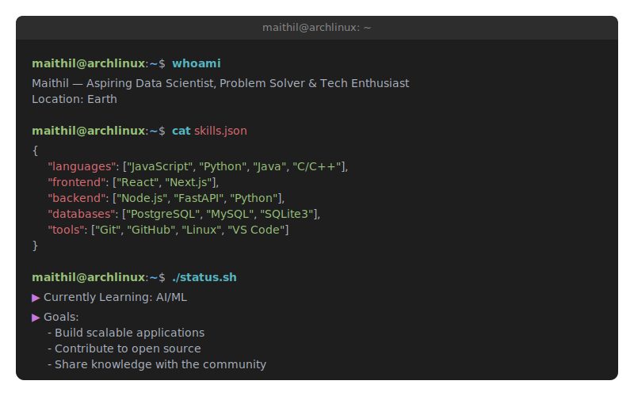

# 👋 Hey, I'm Maithil

### Aspiring Data Scientist | Problem Solver | Tech Enthusiast

---

## About Me

  

---

## GitHub Analytics

  

## Contribution Graph

  

---

## Live Dashboard

  <table>
    <tr>
      <td width="50%" align="center">
        <h3>🎧 Spotify Activity</h3>
        
      </td>
      <td width="50%" align="center">
        <h3>💬 Discord Presence</h3>
        
      </td>
    </tr>
  </table>

   

  
   
  *Powered by my custom [Quotes API](https://quotes-api-ruddy.vercel.app) with 10,000+ quotes!*

---

## Connect with Me

 

**From [Chronos778](https://github.com/Chronos778) with 💙**

*"Code is like humor. When you have to explain it, it's bad."* – Cory House

